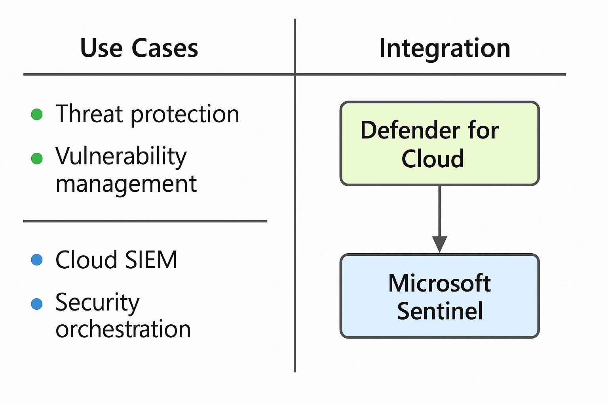

# Microsoft Defender for Cloud vs Microsoft Sentinel

## Overview

Microsoft offers multiple tools for enhancing cloud security posture and threat detection. Two prominent services are **Defender for Cloud** and **Microsoft Sentinel**.

---

## Defender for Cloud

- CSPM (Cloud Security Posture Management) and workload protection platform.
- Provides security recommendations, threat detection, and compliance.
- Integrates with Defender for Endpoint, Defender for SQL, etc.

### Features
- Secure Score
- Regulatory compliance dashboard
- Defender plans for different workloads

---

## Microsoft Sentinel

- SIEM (Security Information and Event Management) and SOAR (Security Orchestration Automation and Response) solution.
- Collects, analyzes, and responds to security data across environments.
- Uses Kusto Query Language (KQL) for data exploration.

### Features
- Analytics rules and alerts
- Incident investigation tools
- Automation with Logic Apps (Playbooks)

---

## Key Differences

| Feature         | Defender for Cloud                | Microsoft Sentinel                      |
|------------------|------------------------------------|-----------------------------------------|
| Type             | CSPM + CWP                        | SIEM + SOAR                             |
| Focus            | Resource-level security posture   | Centralized log analysis and detection  |
| Integration      | Azure-native                      | Cross-platform (multi-cloud, on-prem)   |
| Tooling          | Recommendations, Secure Score     | KQL, Workbooks, Playbooks               |

---

## Common Integration

Defender for Cloud alerts can be forwarded to Sentinel for centralized monitoring and investigation.

---

## Notes

Using both together creates a comprehensive detection and response architecture.

---

## Visual Comparison

